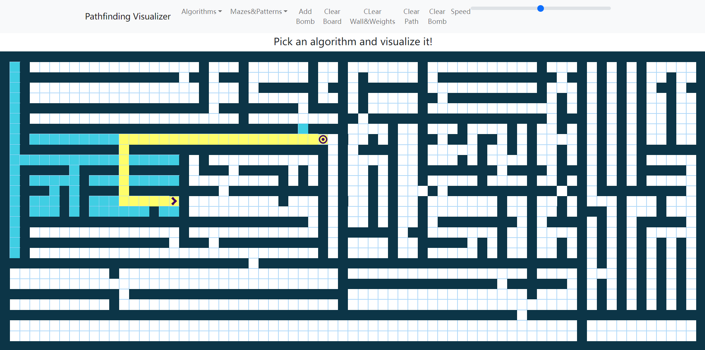

# React Pathfinding

You can play it online : [click here](https://princepride.github.io/react-pathfinding)

## Update
I update A* Algorithm, a better path finding algorithm compared to Dijkstra's Algorithm.

## Introduction

This project was impressed by Clement Mihailescu，but I implemented it with React and Redux,

This project using the Dijkstra's Algorithm to find the shortest path, and use recursion to generate mazes.

You can drag the mouse to adjust the start and end points, and display the search process at the same time.

## User Guide

You can drag the start icon and the target icon to adjust the place of start and end . then click the maze button to select a method to generate maze.

Finally, you can select an Algorithm to find the path(only finished the Dijkstra's Algorithm)
